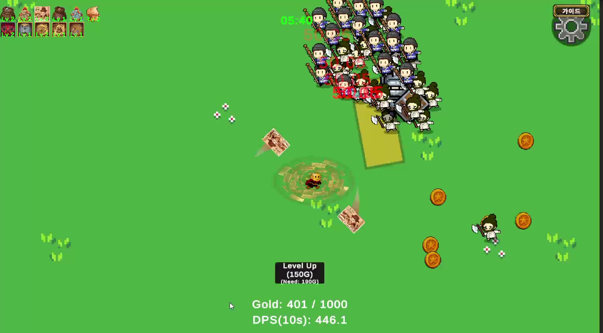

# Coin Survivor — 개발 참여와 QA 사례

팀으로 개발해 STOVE에 출시했으며, Steam 출시도 앞두고 있는 게임입니다. 저는 상점과 인벤토리 개발을 맡았고, 관련 비용과 성장 흐름을 조정하는 밸런싱에도 참여했습니다.

[STOVE](https://store.onstove.com/ko/games/105249) · [Steam](https://store.steampowered.com/app/5034980/Coin_Survivor/)

## 맡은 일

Unity와 C#을 사용했습니다. 평소 즐기던 게임을 참고해 아이템 회전, 가방 확장, 합성 기능을 제안하고 가방과 상점 UI를 개발했습니다. 개발 중에는 QA 팀원의 피드백을 받아 담당 기능을 수정했고, 프로젝트 종료 후에도 직접 플레이하며 개선할 부분을 찾았습니다.

구현·코드 분석·수치표 작성에는 AI 도구를 활용했습니다. 저는 필요한 동작과 문제 상황을 설명하고, 직접 실행해 결과를 확인하며 작업했습니다.

## 대표 이슈: 판매한 무기가 계속 공격하는 문제

2레벨 무기를 판매하면 가방에서는 사라졌지만 실제 공격이 남는 문제를 다뤘습니다. 판매 결과가 실제 무기 제거로 이어지도록 수정한 뒤, 판매한 무기만 제거되는지와 다른 레벨 무기가 유지되는지를 직접 확인했습니다. 판매 확정·취소와 구매·합성도 함께 점검했습니다.

[이슈 보고서](cases/04-weapon-sale.md) · [당시 확인 기록](evidence/weapon-sale-checks.md) · [판매 처리 코드](code/weapon-sale.cs.txt)

## 다른 개선 사례

| 사례 | 유형 | 확인하거나 조정한 내용 |
|---|---|---|
| [자석 획득 효과](cases/01-magnet.md) | 플레이 체감 개선 | 수정 후 실제 획득 범위의 차이 확인 |
| [구매·확장 비용](cases/03-economy.md) | 경제·성장 개선안 | 보유 골드와 구매·확장 비용 비교, 비용 조정안 정리 |
| [진화 무기의 공격 범위와 분열](cases/05-evolved-weapons.md) | 전투 조정 | 화면 밖 공격을 줄이는 반경 제한, 분열 단계 제한 |

판매 사례는 개발 중인 2026년 5월 기록이며, 자석과 진화 무기 조정은 7월 후속 작업입니다.

## 자료 보기

- [대표 이슈 보고서](cases/04-weapon-sale.md)
- [수정 후 확인 기록](evidence/weapon-sale-checks.md)
- [관련 코드 발췌](code/README.md)
- [밸런스 조정안 v5](balance/project2-balance-v5-ko.xlsx) · [시트 안내](balance/README.md)

## 플레이 화면

2026년 7월 플레이 영상에서 가져온 일반 전투 장면입니다.
