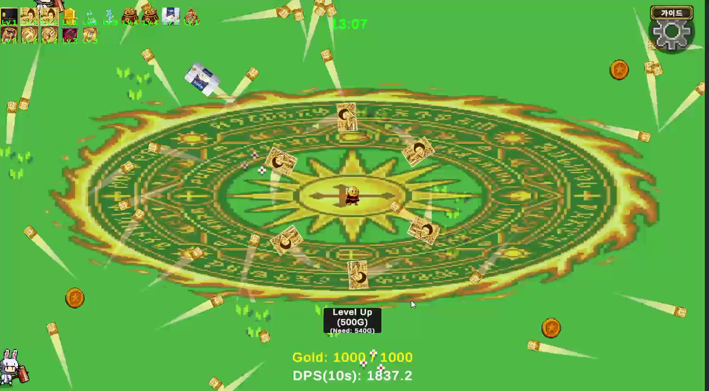

# 진화 무기의 공격 범위와 분열 조정

전투 조정 · 2026년 7월 15일 후속 작업

## 플레이에서 확인한 현상

후반 플레이 영상에서 적이 잘 보이지 않는 구간이 있었습니다. 영상과 코드 분석에서는 화면 밖까지 닿는 공격, 적을 가리는 이펙트, 후반 스폰 보충량 감소가 함께 나타났습니다.

진화 오라는 당시 분석 조건에서 공격 반경이 10으로, 화면의 세로 반경 5보다 넓었습니다. 적이 화면 안에 들어오기 전에 공격받을 수 있는 범위였습니다.

2026년 7월 15일 플레이 영상 22분 30초 지점입니다. 큰 오라와 여러 무기 궤적이 화면을 차지하는 장면입니다.

## 조정한 내용

| 대상 | 변경 |
|---|---|
| 진화 오라 | 공격 반경을 5 월드 단위로 제한하고 플레이어 크기에 따라 다시 확대되지 않게 처리 |
| 진화 근접 무기 | 공격 반경 상한 4.5, 검기 표시 크기 제한 |
| 진화 분열 무기 | 최대 분열 단계 1. 기본 조건의 이론상 동시 투사체 상한을 약 40개에서 약 20개로 제한 |

공격이 닿는 범위와 분열을 줄이고, 이펙트 표시 순서도 조정했습니다. 번개는 투사체 개수 8→4와 개별 피해 2배를 함께 적용해 명목상 2차 피해 총량을 유지했으므로 피해 하향 사례에 포함하지 않았습니다.

## 확인 범위

당시 수정 기록에는 컴파일 오류 확인과 반경·분열·표시 순서의 코드 점검이 남아 있습니다. 조정 후의 최종 체감 위력과 가시성에 대한 플레이 결과는 확보하지 못했습니다. 투사체 수 감소를 실제 FPS 향상이나 피해량 절반 감소로 해석하지 않았습니다.

자석의 획득 범위 개선과는 별개의 전투 조정입니다.
